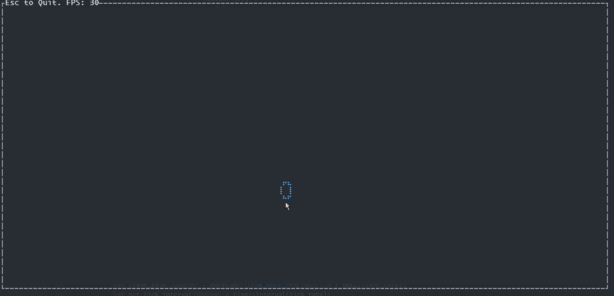
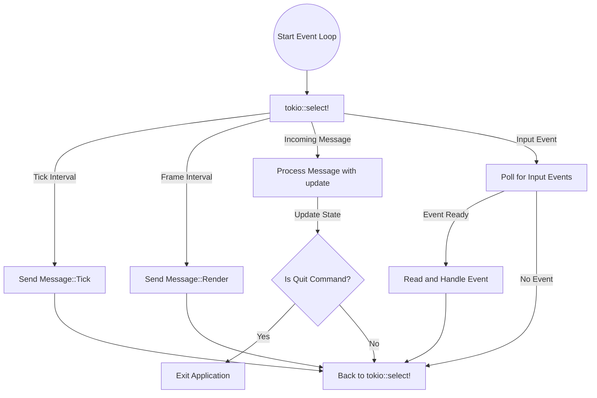

# Handling Multiple Events in Ratatui: Async Immediate Mode Rendering in Rust



This project demonstrates how to handle multiple events asynchronously in [Ratatui](https://ratatui.rs/) using immediate-mode rendering in Rust. It serves as a personal learning exercise to explore event handling, state management, and rendering in a terminal user interface (TUI) environment.
It takes inspiration from [The Elm Architecture (TEA)](https://guide.elm-lang.org/architecture/) for event handling, encapsulating state and logic within the Tui struct. This approach allows asynchronous handling of mouse clicks, keyboard input, and rendering frames in an immediate-mode GUI. However, unlike pure TEA, which typically uses immutable state and stateless functions, this implementation [maintains mutable state within the Tui struct](https://ratatui.rs/concepts/application-patterns/the-elm-architecture/) for efficiency and simplicity in Rust’s environment.

## Immediate Mode GUI
The UI follows an [**immediate-mode GUI**](https://en.wikipedia.org/wiki/Immediate_mode_(computer_graphics)) approach. The `frame_interval` ensures that the UI is updated at a rate defined by `frame_rate` (e.g., 30 frames per second). This guarantees smooth rendering but means that the application continuously redraws the UI, even when no changes have occurred.

If you want to optimize this, you could modify the application to render only when the state changes (e.g., after user input or specific events). This could be done by returning an `UpdateCommand::Render` only when a meaningful change occurs, and rendering based on that signal.

While this optimization is relatively easy to implement, it adds complexity that is often unnecessary for terminal UIs. You'd need to handle edge cases, like throttling render events if too many state changes happen in a short time. For example, if frequent updates occur (like a constant stream of inputs), you might need to limit the number of renders in a given time frame to prevent starvation of other tasks. In most cases, the immediate-mode approach strikes a good balance between simplicity and responsiveness, without the need for this extra complexity.

## The Terminal User Interface(TUI)
The Tui struct is the core structure that manages the terminal interface and controls the flow of the application. This implementation uses [Tokio](https://github.com/tokio-rs/tokio) for the runtime. Using [`tokio::sync::mpsc`](https://docs.rs/tokio/latest/tokio/sync/mpsc/) to send messages to update the `Model`
```rust
pub struct Tui {
    pub terminal: Terminal<CrosstermBackend<std::io::Stdout>>,
    pub frame_rate: f64,
    pub tick_rate: f64,
    pub event_tx: UnboundedSender<Message>,
    pub event_rx: UnboundedReceiver<Message>,
    pub model: Model,
}
```

## State Management
The `Model` struct holds the application's current state. In this implementation, state management is central to how the UI is rendered and updated, as it tracks the position of entities, mouse hover locations, and performance data like FPS. The state is continually updated based on user interactions or timed events, and those changes are reflected in the terminal UI during rendering.
```rust
pub struct Model {
    pub hover_pos: (u16, u16),
    pub entities: Vec<Entity>,
    pub hover_entity: Entity,
    pub fps_counter: FpsCounter
}
```
The `Message` enum encapsulates different types of events that can affect the state of the application. Each Message represents an action, such as ticking (for timed updates), rendering, or processing user input like mouse clicks or hover positions.
```rust
pub enum Message {
    Quit,
    Tick,
    Render,
    MouseLeftClick(u16, u16),
    MouseHoverPos(u16, u16),
}
```
## Updating State
The update function is responsible for processing Message events and updating the state (`Model`) accordingly. For example `Message:Render` ticks the FPS counter and redraws the UI based on the current state.
```rust
    async fn update(&mut self, message: Message) -> Result<UpdateCommand> {
    match message {
        Message::Quit => {
            Ok(UpdateCommand::Quit)
        }
        Message::Tick => {
            for obj in &mut self.model.entities {
                obj.tick();
            }
            Ok(UpdateCommand::None)
        }
        Message::Render => {
            self.model.fps_counter.tick();
            self.view().context("Failed to render")?;
            Ok(UpdateCommand::None)
        }
        Message::MouseLeftClick(row, col) => {
            let x = col as f64;
            let y = self.terminal.size()?.height as f64 - row as f64; // invert to align coordinate system from terminal to canvas widget api. crossterm is top left (0,0), canvas is bottom left (0,0)

            let clicked_entity = self.model.hover_entity.clone();
            self.model.entities.push(clicked_entity); //push the current shape on cursor hover to be drawn by the UI

            let new_entity: Entity = if random::<bool>(){  // assign new random shape(Balloon or Brick) as the hover shape on the cursor's hover position
                Entity::Balloon(Balloon {
                    circle: Circle {
                        x,
                        y,
                        radius: 1.0,
                        color: Blue,
                    },
                    velocity_y: 0.0,
                })
            } else {
                Entity::Brick(Brick {
                    rectangle: Rectangle {
                        x,
                        y,
                        width: 1.0,
                        height: 1.0,
                        color: Red,
                    },
                    velocity_y: 0.0,
                })
            };
            self.model.hover_entity = new_entity;
            Ok(UpdateCommand::None)
        }
        Message::MouseHoverPos(row, col) => {
            // of the two possible hover shapes, render them accordingly
            self.model.hover_pos = (row, col);
            match &mut self.model.hover_entity {
                Entity::Balloon(balloon) => {
                    balloon.circle.x = col as f64;
                    balloon.circle.y = self.terminal.size()?.height as f64 - row as f64; 
                }
                Entity::Brick(brick) => {
                    brick.rectangle.x = col as f64;
                    brick.rectangle.y = self.terminal.size()?.height as f64 - row as f64;
                }
            }
            Ok(UpdateCommand::None)
        }
    }
}
```
## View
The `view` function is responsible for rendering the current state of the application, as defined in the `Model`. It uses[`ratatui::widgets::canvas`](https://docs.rs/ratatui/latest/ratatui/widgets/canvas/index.html) to draw all entities, such as balloons and bricks, onto the terminal screen. This includes both the dynamic entities (e.g., objects affected by gravity) and any static UI elements.

```rust
    fn view(&mut self) -> Result<()> {
        let (term_width, term_height) = self.terminal.size().map(|s| (s.width, s.height))?;
        self.terminal.draw(|f| {
            let screen_area = f.area();
            let x_bounds = [0.0, term_width as f64];
            let y_bounds = [0.0, term_height as f64];
            
            let content = Canvas::default()
                .block(Block::bordered().title(format!("Esc to Quit. FPS: {}", self.model.fps_counter.fps)))
                .x_bounds(x_bounds)
                .y_bounds(y_bounds)
                .paint(|ctx| {
                    match &self.model.hover_entity {
                        Entity::Balloon(balloon) => {
                            balloon.draw(ctx);
                        }
                        Entity::Brick(brick) => {
                            brick.draw(ctx);
                        }
                    }
                    for entity in &self.model.entities {
                        entity.draw(ctx);
                    }
                    ctx.layer();
                })
                .background_color(Black)
                .marker(Marker::Braille);

            f.render_widget(content, screen_area);
        })?;

        Ok(())
    }
```

## Event Loop

At the heart of the application is the asynchronous **event loop**, which is responsible for handling all input, updating the application state, and rendering the UI. This loop runs asynchronously and processes three main types of events:
1. **Ticks**: Regular updates that advance the state (e.g., animations, entity movements).
2. **Render Events**: Triggered only when a state change occurs, prompting the UI to be redrawn.
3. **Input Events**: Handles user input, such as mouse clicks, key presses, or terminal resizing.

[tokio::select!](https://tokio.rs/tokio/tutorial/select): This macro allows the application loop to wait on multiple asynchronous operations simultaneously. It reacts to whichever event occurs first, ensuring that ticks, rendering, and input handling are all processed efficiently and without blocking each other.



```rust
    pub async fn run(&mut self) -> Result<()> {
        self.enter()?;
        let tick_rate = Duration::from_secs_f64(1.0 / self.tick_rate);
        let frame_rate = Duration::from_secs_f64(1.0 / self.frame_rate);
        let mut tick_interval = time::interval(tick_rate);
        let mut frame_interval = time::interval(frame_rate);
        loop { 
            tokio::select! {
                // Handle ticking for state updates (e.g., entity movement or animation)
                _tick = tick_interval.tick() => {
                    if let Err(e) = self.event_tx.send(Message::Tick) {
                        return Err(anyhow::anyhow!("Failed to tick: {:?}", e));
                    }
                }
                // Handle frame rendering
                _frame = frame_interval.tick() => {
                    if let Err(e) = self.event_tx.send(Message::Render) {
                        return Err(anyhow::anyhow!("Failed to render frame: {:?}", e));
                    }
                }
                 // Handle incoming messages, such as user input events or system commands
                Some(message) = self.event_rx.recv() => {
                    match self.update(message).await? {
                        UpdateCommand::Quit => return { // return, exiting the loop and the application. 
                            self.exit()?;  // pedantic as Tui implements the Drop trait, which calls exit anyhow. 
                            Ok(())
                        },
                        UpdateCommand::None => continue,
                    }
                }
                // Polling for user input events asynchronously
                Ok(ready) = tokio::task::spawn_blocking(|| crossterm::event::poll(Duration::from_millis(100))) => {
                    match ready {
                        Ok(true) => {
                            let event = crossterm::event::read()?;
                            if let Err(e) = self.handle_event(event) {
                                return Err(anyhow::anyhow!("Failed to handle event: {:?}", e));
                            }
                        }
                        Ok(false) => continue,
                        Err(e) => {
                                return Err(anyhow::anyhow!("Failed to poll for events: {:?}", e));
                            }
                    }
                }
            }
        }
    }
```

## That's it
This approach, running at 30 frames per second and 10 ticks per second, provides a responsive and efficient terminal UI suitable for most applications.
```rust
#[tokio::main]
async fn main() -> Result<()> {
    if let Err(e) = run_app().await {
        println!("application exited with error: {}", e);
        std::process::exit(1);
    }
    Ok(())
}

pub async fn run_app() -> Result<()> {
    let mut app = Tui::new(30.0, 10.0).context("Failed to initialize the terminal user interface (TUI)")?;
    app.run().await?;
    Ok(())
}
```

## Animating Balloons and Bricks

In the example, two types of shapes are drawn randomly using the rand crate:
- Balloon: Floats upward and away, simulating a gentle upward motion due to gravity. 
- Brick: Falls and crashes to the ground, simulating a heavier object pulled down by gravity.


#### The `Drawable` trait 
```rust
pub trait Drawable {
    fn tick(&mut self);
    fn draw(&self, ctx: &mut canvas::Context);
}
```
Implemented shapes like `Balloon` can have hold the state of their `velocity_y` so for each `Tick` event the state of a Balloon shape can be affect by this "physics".
```rust
pub struct Balloon {
    pub circle: Circle,
    pub velocity_y: f64,
}
```
Each `Tick` event updates the vertical position of the Balloon and Brick based on their velocity. Gravity affects the velocity differently for each entity: a Balloon floats slowly upward, while a Brick falls more quickly downward.
```rust
impl Drawable for Balloon {
    fn tick(&mut self) {
        let gravity = 0.10; 
        self.velocity_y += gravity; 
        self.circle.y += self.velocity_y; // Move the balloon upward

        let bottom_y = self.circle.radius; 
        if self.circle.y < bottom_y {
            self.circle.y = bottom_y;  // Stop at the boundary
            self.velocity_y = 0.0; // Halt movement
        }
    }

    fn draw(&self, ctx: &mut canvas::Context) {
        ctx.draw(&self.circle); // Draw the balloon as a circle. This could be a more complicated shape, for simplicity it's just a circle. 
    }
}
```